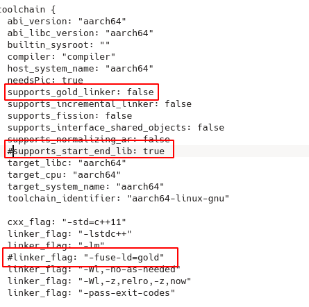

#### 1、配置

下载tensorflowf 1.10.0

1、环境

```shell
mod@mod ~ $ aarch64-linux-gnu-gcc -v
gcc version 5.5.0 (Linaro GCC 5.5-2017.10)

mod@mod ~ $ screenfetch 
                   -`                 
                  .o+`                 mod@mod
                 `ooo/                 OS: Arch Linux 
                `+oooo:                Kernel: x86_64 Linux 5.4.96-1-lts
               `+oooooo:               Uptime: 11h 8m
               -+oooooo+:              Packages: 1538
             `/:-:++oooo+:             Shell: bash
            `/++++/+++++++:            Resolution: 1366x768
           `/++++++++++++++:           DE: KDE 5.78.0 / Plasma 5.20.5
          `/+++ooooooooooooo/`         WM: KWin
         ./ooosssso++osssssso+`        GTK Theme: Breeze [GTK2/3]
        .oossssso-````/ossssss+`       Icon Theme: breeze
       -osssssso.      :ssssssso.      Disk: 653G / 892G (78%)
      :osssssss/        osssso+++.     CPU: Intel Core i5-5200U @ 4x 2.7GHz [82.0°C]
     /ossssssss/        +ssssooo/-     GPU: Intel Corporation HD Graphics 5500 (rev 09)
   `/ossssso+/:-        -:/+osssso+-   RAM: 8340MiB / 15927MiB
  `+sso+:-`                 `.-/+oso: 
 `++:.                           `-/+/
 .`                                 `/
 
mod@mod ~ $ bazel version
WARNING: --batch mode is deprecated. Please instead explicitly shut down your Bazel server using the command "bazel shutdown".
Build label: 0.15.0
Build target: bazel-out/k8-opt/bin/src/main/java/com/google/devtools/build/lib/bazel/BazelServer_deploy.jar
Build time: Tue Jun 26 12:10:19 2018 (1530015019)
Build timestamp: 1530015019
Build timestamp as int: 1530015019

```

2、修改配置文件

见参考链接

#### 2、编译命令 

1、参考链接里的

```shell
bazel build -c opt //tensorflow/examples/label_image --cpu=aarch64 --crosstool_top=//tools/aarch64_compiler:toolchain --host_crosstool_top=@bazel_tools//tools/cpp:toolchain --verbose_failures
```

按这个编译只有libtensorflow_framework.so

2、修改后的

```
bazel build -c opt //tensorflow:libtensorflow_cc.so --cpu=aarch64 --crosstool_top=//tools/aarch64_compiler:toolchain --host_crosstool_top=@bazel_tools//tools/cpp:toolchain --verbose_failures
```

#### 3、notion

1、bazel需要下文件代理

2、强烈建议开启verbose模式，重来来一次要几个小时QAQ

#### 4、错误排查

1、collect2: fatal error: cannot find 'ld'

```
ERROR: /home/mod/code/DL/google/tensorflow/tensorflow-1.10.0/tensorflow/BUILD:481:1: Linking of rule '//tensorflow:libtensorflow_framework.so' failed (Exit 1): aarch64-linux-gnu-gcc failed: error executing command 
  (cd /home/mod/.cache/bazel/_bazel_mod/66a4afc58eed0b917279c49f46f0f985/execroot/org_tensorflow && \
  exec env - \
    LD_LIBRARY_PATH=/usr/local/lib: \
    PATH=/home/mod/soft/bazel:/usr/share/bcc/tools:/home/mod/Android/Sdk:/home/mod/Android/Sdk/tools:/home/mod/Android/Sdk/platform-tools:/home/mod/.cargo/bin:/home/mod/.local/bin:/home/mod/code/devel_board/100ask_imx6ull/linuxOS/100ask_imx6ull_mini-sdk/ToolChain/gcc-linaro-6.2.1-2016.11-x86_64_arm-linux-gnueabihf/bin/:/home/mod/.tiup/bin:/home/mod/.cargo/bin:/usr/local/sbin:/usr/local/bin:/usr/bin:/usr/lib/jvm/default/bin:/usr/local/java/jdk1.8.0_251/bin:/usr/local/java/jdk1.8.0_251/jre/bin:/home/mod/code/postgraduate/bst/arm-2009q3/bin:/home/mod/soft/aarch64/aarch64_install:/opt/gradle/gradle-6.1.1/bin \
    PWD=/proc/self/cwd \
    PYTHON_BIN_PATH=/usr/bin/python2 \
    PYTHON_LIB_PATH=/usr/lib/python2.7/site-packages \
    TF_DOWNLOAD_CLANG=0 \
    TF_NEED_CUDA=0 \
    TF_NEED_OPENCL_SYCL=0 \
  /home/mod/soft/aarch64/gcc-linaro-5.5.0-2017.10-x86_64_aarch64-linux-gnu/bin/aarch64-linux-gnu-gcc -shared -o bazel-out/aarch64-opt/bin/tensorflow/libtensorflow_framework.so -Wl,--version-script tensorflow/tf_framework_version_script.lds '-Wl,-rpath,$ORIGIN/' -Wl,-soname,libtensorflow_framework.so -pthread '-fuse-ld=gold' -Wl,-no-as-needed -Wl,-z,relro,-z,now -pass-exit-codes -Wl,--gc-sections -Wl,-S -Wl,@bazel-out/aarch64-opt/bin/tensorflow/libtensorflow_framework.so-2.params)
collect2: fatal error: cannot find 'ld'
```

把命令改成，可以编译

```
/home/mod/soft/aarch64/gcc-linaro-5.5.0-2017.10-x86_64_aarch64-linux-gnu/bin/aarch64-linux-gnu-gcc -shared -o bazel-out/aarch64-opt/bin/tensorflow/libtensorflow_framework.so -Wl,--version-script tensorflow/tf_framework_version_script.lds '-Wl,-rpath,$ORIGIN/' -Wl,-soname,libtensorflow_framework.so -pthread -Wl,-no-as-needed -Wl,-z,relro,-z,now -pass-exit-codes -Wl,--gc-sections -Wl,-S -Wl,@bazel-out/aarch64-opt/bin/tensorflow/libtensorflow_framework.so-2.params
```

淦，我下的aarch64(5.5)就没有gold的linker，6版本有，速度会快https://blog.csdn.net/ayu_ag/article/details/78552801

做如下修改即可使用默认的linker



#### 5、头文件转移

参考https://blog.csdn.net/Felaim/article/details/102784364

```
.
├── bazel-bin
├── bazel-genfiles
│   ├── external
│   └── tensorflow
├── tensorflow
│   ├── cc
│   └── core
└── third_party
    └── eigen3

```

一键转移脚本TODO

#### 6、编译其他的依赖库

protobuf

```shell
# 下载
3.6.0版本
bazel-out/aarch64-opt/genfiles/tensorflow/core/lib/core/error_codes.pb.h中有如下约定
#if GOOGLE_PROTOBUF_VERSION < 3006000
#error This file was generated by a newer version of protoc which is
#error incompatible with your Protocol Buffer headers.  Please update
#error your headers.
#endif
#if 3006000 < GOOGLE_PROTOBUF_MIN_PROTOC_VERSION
#error This file was generated by an older version of protoc which is
#error incompatible with your Protocol Buffer headers.  Please
#error regenerate this file with a newer version of protoc.
#endif
# 编译
./autogen.sh
./configure --host=aarch64-linux-gnu CC=aarch64-linux-gnu-gcc CXX=aarch64-linux-gnu-g++ --with-protoc="/usr/bin/protoc" --disable-shared --enable-cross-compile --prefix=`pwd`/build-arm64

```

Eigen

```shell
# 下载
版本 3.3.90
# 编译
mkdir build && cd build
cmake CMAKE_C_COMPILER=aarch64-linux-gnu-gcc CMAKE_CXX_COMPILER=aarch64-linux-gnu-g++ ..
make
make install DESTDIR=./install
```

#### 参考

https://blog.csdn.net/weixin_37958647/article/details/108500975

https://github.com/xifengcun/tensorflow-aarch64-crossbuild